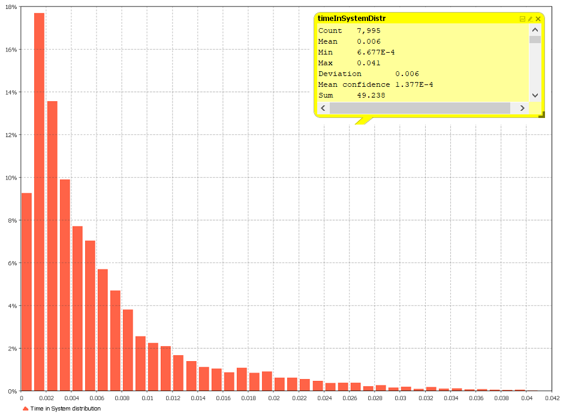

# IDS6145(SimTech 2018) - Research Plan

> * Group Name: The Quarter Dirty Dozen
> * Group participants names: Brian Varns, Gabrielle Vasquez, Matthias Weber
> * Project Title: City-Traffic-Planning

Our project is dealing with the issue of city-planning and in special measures that can decrease the traffic in certain areas (e.g. by adding new roads). We decided to take the example of the Autobahn (A10) that is surrounding Berlin as our model. Once we create this model we want to analyze the resulting traffic data (including hotspots) to identify where traffic is at its worst. Once we determine these spots we will add additional highways to determine if this will alleviate traffic or cause additional hotspots to arise in different areas.

Figure 1: Map of A10

## General Introduction

Congestion on any modern highway greatly reduces our quality of life and steals our valuable free time.  There have been many proposed solutions to fix this issue, such as autonomous vehicles, connected vehicles, ramp metering, and active traffic monitoring.  (Dvosrsky, 2014)  These technologies will allow vehicles to move in a more efficient manner on roadways and move them along the most efficient path to their destination.  However, these technologies are years, if no decades away from realization and the cost of implementation would cost hundreds of millions of dollars.  Are these new technology really the solution to this issue or can some common sense could put an end to traffic congestion? 

## Problem Statement: 

A 2010 RAND study noted that traffic congestion is created by an imbalance in the supply of and demand for road space.  This, coupled with the fact that we have limited options to build ourselves new roads that bypass these issues, is creating traffic jams in large cities on a scale never seen before.  (Sorensen, et al. 2010)  Autobahns located in Germany in 2017 experienced: (Mcintosh, 2018)

+ Traffic jams increased by 4 percent in 2017 or by 723,000 more than 2016.

+ The length of the jams in 2017 totalled 1,448,000 kilometers (899,745 miles), a rise of 5 percent.

+ Road users were stuck in traffic for a total of 457,000 hours, a rise of 9 percent.

## Motivation:

Traffic congestion on the Autobahn is amongst the worst in the world.  This congestion has many issues that are similar amongst many different roadways in the world and has taken a toll on driving safety, air quality, and quality of life for its citizens. Future technologies are being created to ease this issue, but are many years away from being effectively implemented.  If a simple solution can be found, by adding key roadways, it will save countries millions of dollars and allow for further research to identify how to alleviate traffic congestion in other cities. 

## Proposed Solution:

To complete this experiment the researchers will conduct a study to identify a strategy to reduce traffic congestion that could be implemented in different cities across the world.  For the purpose of this experiment we will use the Autobahn 10 in Germany.  The researchers reviewed literature related to congestion and typical driving patterns of humans, examined existing data for traffic flow on and off of the Autobahn, and will analyze historical hotspots for traffic congestion.  With this data we will create a model of the Autobahn, of vehicles (cars and trucks), and of drivers.  Once created we will run this model to identify key hotspots on the Autobahn and develop simple bypasses for alleviating this congestion.

## Contributions:
+ Our research should present a resilient approach/guidance for city-planner to fight the common traffic problems of congestion
+ Our research will be replicable to allow large cities to analyze their traffic congestion.
+ Our code and models will be open sourced to be used by any individual or organization.

## The Model
Our created model is a good abstraction of the given problem, due to the fact that we tried to focus on the core elements “Road” and “Vehicle”. The element “Road” is consisting out of “Lanes” and several “ON/Off-sections”. Whereas the element “Vehicle”, that will interact with the previous mentioned parts, is consisting out of the elements “Car” and “Truck”.  The vehicle component will have the ability for freedom of movement, meaning they will have the ability to enter and exit freely to get to their destination; the "Vehicle" will operate simliarly to typical, human driving behaviors in that the "Vehicle" driving behavior will be more predictiable than humans.  This will be part of their programing and is the reason we left out “People” from the experiment.  

Figure 2: Object Diagram

 

Figure 3: Behavior Diagram

We identified these elements, due to the following requirements:
+ The simulation should mimic the traffic-situation on the A10, that is surrounding Berlin (Germany)
+ The simulation-model must pay attention to the dimension of the corresponding and used roads
+ The model should just pay attention to the major in- and outflow areas
+ The position of the in- and outflow areas should be based on their counterparts in the real world
+ The simulation must handle 2 different kind of vehicles (car and truck) 
+ The simulation must include car following behaviour
+ As a data source the simulation must use appropriate collected and realistical data
+ The simulation should show whether infrastructural improvements can significantly reduce congestions or not

## Fundamental Questions
In the first part of our project, we want to clarify if the traffic situation can be adequately mapped, including the existing restrictions on the traffic flow.  Our primary question here focuses on determining the peak traffic times and locations of congestion.  Our primary question, “Can we reduce traffic through common sense city planning”, will then be tested through our experiment.  We will do this by identifying if infrastructural measures can reduce traffic congestion (by adding one or more streets of the same type) or even eliminate them. Or whether the restrictions take place in another area and therefore other suitable measures need to be researched.

## Expected Results

For our two fundamental questions we expect for first identify traffic congestion during peak times.  We expect these conjestion areas to align with heavy traffic flow from the busiest on and off ramps identified in Figure 8.  Once identified we will attempt to allieviate this traffic through addition or subtraction of roads (on and off ramps, highways).  Below are some proposed solutions to reduced traffic congestions bz adding routes in along different parts of the A10:4

 <u>1 road from North to South:</u> 

Figure 4: Expected Results (v1)

 <u>1 road from West to East:</u> 

Figure 5: Expected Results (v2)

 Mix from both previous attempts: 

Figure 6: Expected Results (v3)

## Research Methods

**Models

For this simulated experiment, we will be developing simulated cars and agents to mimic the common driving behaviors of everyday human, civilians. The sample size that we have implemented within the simulation was based on real and synthetic data that we have derived  from www.bast.de and http://www.autobahnatlas-online.de/A10.htm.

**Experimental Protocol 

For the purpose of this project, we will be implementing an agent-based simulation using AnyLogic to simulate our experiment. We plan on running our simulation 10 times to ensure our data accurate to the best of its capabilities. 

**Experimental Paradigm 
 
In setting up the simulation, we have ensured that the agents developed best mimicked the driving behaviors of humans by having them have the possibility of committing am rear-end accident. These agents were developed based from a comparison study conducted by McDonald, Curry,  Kandadai, Sommers, & Winston (2014). They found after looking at data comparing across ages and genders that the most common crash incident to occur among all groups were rear-ended accidents. Such accidents will be simulated into a design to mimic one of the possible ways that highway traffic could occur. 
Overall, the simulation will be developed in such a way to accurately mimic the typical behaviors we see in human driving behaviors and functions of motor vehicles.
 

## Data

The below image includes the 14 identified On/Off-sections, with the amount of vehicles per day for the road-section between these areas.  We will use this data to determine how many cars will enter and exit the points of the A10 and identify where and when traffic congestion occurs.

Figure 7: On/Off-sections

The length of the A10 is 195 km in total and the locations for the On/Off-sections are located at the following autobahn-positions:

Figure 8: A10 Real Data

The A10 consists of three lanes of traffic heading in both directions.  There is one exception, which is between point 9 and point 14 where the A10 offers two lanes for each direction.
 
(image of the model and code)

## Results

This experiment was conducted in two phases, the first phase required us to develop a model to represent the behaviors of the A10.  The first phase was complete once we ran the simulation and collected data on where hotspots developed on the A10.  The second phase was to develop a bypass and see if this changed the behavior of the model and relieved these hotspots.  

**PHASE 1**

With the model of the A10 developed we needed to implement behaivors into the agents (vehicles) that would allow them to decide whether they wanted to stay on the road, or take the next off-ramp.  To do this we developed stay probabilities in each of the decision nodes, this was set to 80% meaning the cars had a 20% chance to get off the A10 at each off ramp.  We did this to ensure cars would only stay on the A10 for approximately 4-5 off ramaps, an accurate behavior we gathered from our real world data, while some would stay on the A10 for no more than 8 off ramps.  It's important to note that this probability did not change for the remainder of the experiment.

Additionally, we needed to develop accurate traffic flow that would represent the A10 during morning and afternoon traffic.  To do this we utilzed our real world data represetned in Figure 7.  This data was then assigned to the requisite on ramp and divided by two, half the number being assigned to the two on ramps in an area.  Because this model was built to 1/10 scale we then took those numbers and multiplied them by .1, which gave us our traffic source numbers for each of the on ramps.  These vaules remained the same for all experiments.  

With the model completed we add a distribution map that allowed us to track how long each agent was on the A10.  The purpose of this plot was to gather how long each agent stay on the A10 and to allow us to determine if the solution we developed actually helped increase or decrease overall traffic times.  The last thing the researchers did to the model was add a heat map that depicted in green, yellow, orange, and red where hotspots were developing.  Below is an image of model after running and the results.

**Figure 8: Density Map for No Bypass**

We could see that there were two primarly traffic flow issues from Phase 1.  Hotspots were occuring at intesection 10 and 13, while the rest of the A10 ran smoothly.  These areas of the map are where they A10 shrinks from three lanes to two lanes, or shortly there after in the case of intersection 10.  Each run of the simulation gave us the same results where traffic always seemed to back up at these on and off ramps.  Below is an image of these traffic jams.

**Figure 9: Intersection 10 Hotspot**

**Figure 10: Intersection 13 Hotspot**

Data collected from the distribution plot shows how long each of the entities stayed on the A10 during the simulation.  Important to note that this data was collected an analyzed in Days, meaning we got very small numbers for each of the plot values, this data was then collected and analyzed by the researchers and calculated into minutes for the purpose of this paper.  Below is an image of the distribution plot and a table of our results.

**Figure 11: Phase 1 Distribution Plot**

|         |            |   |   |   | | | |
| ------------- |:-------------:| -----:| -----:| -----:| -----:| -----:| -----:|
|Experiment|Count|Mean|Min|Max|Deviation|Mean Confidence|Sum|
|**Phase 1**|11,251|8 Min 38 Sec|6.579E-4|53 Min 17 Sec|7 Min 12 Sec|9.456E-5|63.265 Days|

**Table 1: Phase 1 Data**

Phase 1 results show that on average vehicles stayed on the A10 for a total of 8 minutes and 38 seconds, with a min so small it's hard to calcualte in minutes and a max of 53 minutes and 17 seconds.  It is far to assume that vehciles who had the highest average time in the system were stuck between intersections 10 and 13 of the model.  In an attempt to fix this issue and determine if we could get the A10 to have minimum to no traffic hotspots we decided to develop a bypass that ran from intersection 10 to intersection 13.

**PHASE 2**

Once we determined where we were going to build our bypass we added additional code that allowed the cars to determine if they were going to take the bypass, or stay on the road.  To control this we set up three sub phases that set different probabilities that people would take the bypass or stay on the A10.  We did this to determine if the German Government could set up some sort of Quick Pass, like Florida has, to control the number of cars that can take the bypass at a given time.  This sort of control would allow them to manage traffic flow better, if a bypass was beneficial to the A10.

The bypass was built using a two lane system, meaning there were two lanes going each way.  The on and off ramps were controlled through a decision node that had an assigned bypass probobability.  This probability was set to 1 - bp prob and we then created a paramter that allowed us to set a value to determine this probability.  This value indicated the probability that agents would take this bypass.  We then ran three experiments changing this value to 0.3, 0.5, and 0.7 to determine if controlling the number of vehicles on the bypass could alleviate traffic on the A10.

**Phase 2: Sub Phase 1**

Phase 2(1) set the bypass probability to 0.3 meaning only 30% of the vehicles would choose to take the bypass.  The remaining 70% would continue on the A10 with bevaviors established in Phase 1.  Below is an image of the simulation once the run was completed and an image of the data.  

**Figure 12: Phase 2(1) Model**

The traffic map shows that minimal utilization of the bypass actually freed up the traffic jam from intersection 13 and allowed traffic to move at a slower pace, but not become conjested where vehicles would barely move.  This did create increased traffic in intersection 2, 3, 4, 5, 7, 8, 9, 10, 11 and 14, however these were not complete traffic jams, but rather slower moving traffic.  It's important to note that no behaviors, i.e. speed limite, of the agents was changed for Phase 2, so the model and agents behaved the same.  The bypass seemed to allow the traffic to move more freely, but at a decreased speed.  

**Figure 13: Phase 2(1) Distribution Plot**

|         |            |   |   |   | | | |
| ------------- |:-------------:| -----:| -----:| -----:| -----:| -----:| -----:|
|Experiment|Count|Mean|Min|Max|Deviation|Mean Confidence|Sum|
|**Phase 2(1)**|7,995|8 Min 38 Sec|6.677E-4|59 Min 2 Sec|8 Min 38 Sec|1.377E-4|49.238 Days|
**Table 2: Phase 2(1) Data**

Phase 2(1) results show that on average vehicles stayed on the A10 for a total of 8 minutes and 38 seconds which was the exact same as Phase 1.  Again, like Phase 1 the min was so small it's hard to calcualte in minutes, however the max is where the two experiments begin to deviate.  The max of phase 2(1) was 59 minutes and 2 seconds, which was almost a six minute increase.  This can be seen in the increased mean confidence as well, meaning the cars generally stayed longer on the A10.  This is most likely due to the slower traffic times depicted by the traffic map.  It is fair to say that this simulation created the best model that behaved like real traffic, but this issue will be addressed in the Discussion section of this paper.

**Phase 2: Sub Phase 2**

Sub phase 1 set the bypass probability to 0.5 meaning 50% of the vehicles would choose to take the bypass.  The remaining 50% would continue on the A10 with bevaviors established in Phase 1.

Sub phase 1 set the bypass probability to 0.7 meaning 70% of the vehicles would choose to take the bypass.  The remaining 30% would continue on the A10 with bevaviors established in Phase 1.

An Exponetial distrubtion was used to see what effect it had on arrival rate on the cars in this model. The purpose of using the Exponential distribution is for its ability to represent the time between random occurrences, such as the time between arrivals at a specific location in a queuing model, in our experiment, eliminating traffic on the Autobarn 10 in Germany. It has also been used to represent the services times of a specific operation. Further, it serves as an explicit manner in which the time dependence on noise may be treated. One issue we have came across was that we cannot apply an exponential distribution. For each on and off ramp, we have set the probabilities so that each car has the probability of using the bypass to observe the possible ways of eliminating traffic; setting a probablility could prove useful to implement a tax to use the AutoBhan 10 or not. 

While we had our simulation run, we had bar graphs running adjacient to collect statistics on the mean time that our cars had stayed in the simualtion. During those runs, we found that all cars have stayed in the simulation for a M = 8.64 minutes; these results were consistent for all runs. We did, however, find difference in the number of cars that were in our simulation. During the inital run, we have counted a total number of 11,251 cars on the Autobahn 10, however, the desity map shown below indicated heavy traffic - this had also included the additional of the bypass. It was then during the second run we had found less traffic build up after resetting the probability of taking thr bypass to 0.3 and that the number of cars appearig on the Autobahn 10 reduced to 7,995 cars. During our thrid run we found that by resetting the probablility of taking the bypass to 0.7 had further educed the number of cars on the Autobahn 10, but this had then also indicated heavy traffic, as shown in our density map. 

Before setting the probablility of exiting as 0.3, our density map demostrated heavy traffice occuring throughtout the Autobahn 10, with the most congested exits being arounf Exit 10 and Exit 13; this is demostarted in the desity map below (Figure --). By then adding in the bypasses to the Auto Bahn 10, we then saw the roads becoming less congested, but this did not change for exits 10 and 13. These exits seem to become backed up no matter what was done to fix this. We assume that these congestion points occur due to drivers utalize these exits the most, which then led to tarffic becoming congested at these points.

We did not discover any difference in effect size after multiple runs of our simulation. We found that no matter the number of times we run the simulation, we would see similar results. This causes an issue with validity of the model itself, which then leads us to believe there are issues with our simulation that we unable to determine. We have also saw issues in the behaviors of the cars themselves. Collisions were occuring in areas that were causing the cars to be backed up, eventually causing the cars on the Autobahn 10 to stop moving. The cars that tend to be affected by these collision issues are those around exit 10 and 13. 

(insert image here) 

Figures 1 & 2: The above images depicts traffic on exits 10 and 13. All intersections were built identical to one another, however, we have ran into issues which traffic would build up on these exits.

## Discussion

Our hypothesis was to find a method to decrease traffic on the Autobhan 10. We had built our model to include different bypasses to see if the implementation of these bypasses would benefit traffic such as to reduce back up and prevent collisons on these roads. Based on the statistics and denisty maps that were collected during our simulation runs, we would suggest that the implementation of the bypass on the Autobahn 10 be a government controlled road, similar to the system that is implemented in the Florida road system (i.e. the Fast Pass system). With such a system, we would suggest charging taxes to the citizens of Germany to allow them to use the bypass which will then decrease traffic on these roads; we assume that only a certain percentage of drivers will pay the tax to use this bypass allowing the other roads to not become overcrowded. Allowing a charge to use the bypass will then not only reduce traffic on the Autobhan 10, but will also keep the number of people using the bypass to minimum.  

We have put in the efforts to replicate each exit to eliminate the issues of collisions and traffic, however, these exits tend to be affected no matter what we decide to implement (elongating roads, adding exits prior to other exits, etc.). Due to the capabilities of AnyLogic’s Learner Edition, we were limited to the functionalities that we could implement in this expeirment. There is a possilbity that this problem was occuring because of AnyLogic's ability to handle these types of problems; modeling such a problem is too large and requires too much processing power from AnyLogic. We were also limited to amount of code we could use for our model. The AnyLogic's Learner Edition limits users to 200 boxes for their code; our base model code is alone over 100 boxes. Due to this limitation, we were unable to properly build our model to fix the complications that we have encountered. This issue had also prevented us from further testimng with the direction of the roads; this particular model needed more than 200 boxes worth of code which AnyLogic did not allow us to do. This effected our ability to test other bypasses. We focused our efforts in decreasing traffic in areas that were getting built up the most, which was the bypass from North to South. 

Due to complications from the build of our simulation, we have came to the possibility of two reasons as to why this would occur: 1) the AnyLogic program was not built to handle a simulation of this type and another program should be used to model this issue or 2) adjustments to the construction of the Autobahn 10 must be made. AnyLogic is primarily a multimethod simulation modeling tool meant to model discrete, agent-based, and system dynamics. Given this, this makes AnyLogic ideal for investigating road traffic systems, which is what we were interested in. We had chosen to model and simulate our problem with the AnyLogic system because of its ability to model the characteristics of road traffic (traffic jams, cars entering and exiting from exits and roads, etc.). Working more with this system, we started seeing issues with our simulation in that we had collisions occurring in areas of the Autobahn 10; cars were getting stuck on the exits. We discovered that the methods we were going about with trying to solve this issue were not working, which then leads us to believe that the AnyLogic system was not ideal for such a model. 

The AnyLogic Learner Edition only allows users to run models for only an hour. This limits us to use real world data to accurately simulate problems that run for a minmiumn of 24 hours. We also assume that the AnyLogic Learner Edition lacks processing power in that it is unable to handle the amount of variables, paramters, agents, etc. that we have included within our model - is it not built for such high, processing power models that contain high values. It has forced us to manipulate the code to change the model's behavior. This has disabled us to properly represent the behaviors of cars in an applied setting; we were not able to account for ecological validity. This then led us to believe that the behaviors cars are not representative of what we would see on the Autobahn 10 or any other highway.

## Future Work

For future implementation, we would go about with running our model in an edition of AnyLogic that is not the student package. As stated in the previous section, the student edition has limited us fro being able to run our model for the time necessary to have accruate results; the program only lets us run our simulation for an hour. We would want to utilize the features in the other AnyLogic editions in hopes that we can run our model properly and get results that would ptoperly represent what we would see in an applied setting. Further, we believe that we will not be as limited in what we can do with our model and run for a full day versus the one hour maxmium from AnyLogic's Learner Edition. 

With other simulations editiors and languages out there to our deposal, we would possibly want to take advanatge of these systems. We are particularly interested in using a gaming engine to help visualize and simulate our model that was orginally built in this experiment; we would lean towards using Unreal Engine to run this simulation. Unreal Engine has a visualization coding system that allows for its user and developers to "code" while visualizing how componenets (agents, objects, etc.) intertact with one another. If we were allowed the option to look at how our agents were interacting with their environment and other components in the simulation, we may have been able to troubleshoot where and why collisions were occurring the way they were in our experiment. Unreal Engine also has the processing capability to run dynamic, complex systems such as our model. With these considerations, we believe that we will then be able to also account for ecological validity along with having the processing power to properly test our simulation. Even though not commonly used, there is method of being able to collect statistics; dependent on some coding knowledge, collecting whatever statistics desired for this type of expertmentation is possible. 

Replication of the Autobahn 10 will be critical for future experimentation of this model and to be successful in doing so, we would then need to look into the possbility of importing real world data into these types of systems. Currently, there is no method of importing real world data into the Unreal Engine. Unreal Engine does allow the capability to "hard code" (code by hand for certain functionalities) and we would be interested in knowing the methods required to implement these methods for future experimentation. Overall, future work should focus on finding a system that can handle the processing needs of a complex, dynamic model and look into methods of importing real world data into these systems to then replicate the environments that were are looking to solve these problems for. 

## References

Dvorsky, G. (2014). Here’s how to get rid of traffic jams.  Found at: https://io9.gizmodo.com/could-new-technologies-make-traffic-jams-a-thing-of-the-1602353172

McDonald, C. C., Curry, A. E., Kandadai, V., Sommers, M. S., & Winston, F. K. (2014). Comparison of teen and adult driver crash scenarios in a nationally representative sample of serious crashes. Accident Analysis & Prevention, 72, 302-308.

Navigation und Service. (2018). Retrieved February 22, 2018, from http://www.bast.de/DE/Verkehrstechnik/Fachthemen/v2-verkehrszaehlung/Aktuell/zaehl_aktuell_node.html?cms_map=1&cms_filter=true&cms_jahr=Jawe2016&cms_land=12&cms_strTyp=&cms_str=&cms_dtvKfz=&cms_dtvSv= 

Mcintosh J. (2018).  German traffic jams piled on misery for drivers in 2017.  Found at:http://www.dw.com/en/german-traffic-jams-piled-on-misery-for-drivers-in-2017/a-42268383

Scholl, P. (2018). Autobahnatlas. Retrieved February 22, 2018, from http://www.autobahnatlas-online.de/A10.htm
Sorensen, P., Wachs, M., Daehner, E., Kofner, A., Ecola, L., Hanson, M., Yoh, A., Light, T., Griffin, J. (2010). Reducing Traffic Congestion in Los Angeles. Found at: https://www.rand.org/pubs/research_briefs/RB9385.html

