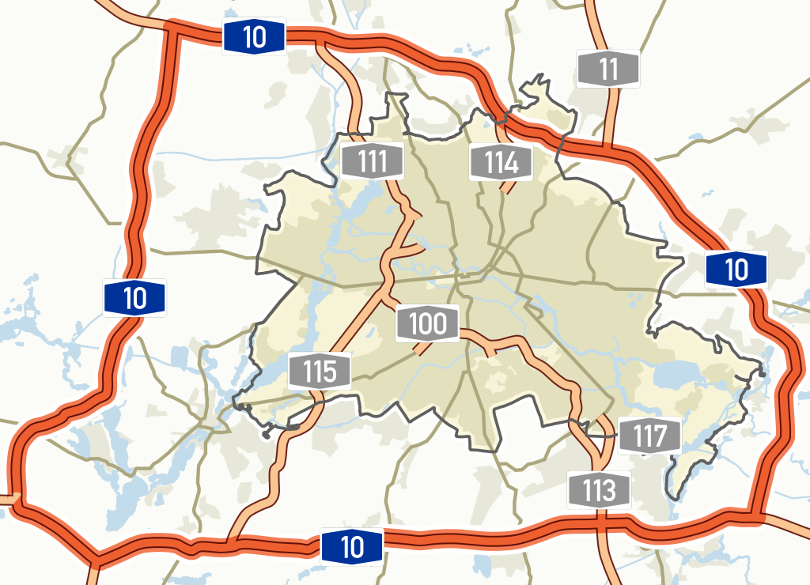

> * Group Name: The Quarter Dirty Dozen
> * Group participants names: Brian Varns, Gabrielle Vasquez, Matthias Weber
> * Project Title: City-Traffic-Planning

Our project is dealing with the issue of city-planning and in special measures that can decrease the traffic in certain areas (e.g. by adding new roads). We decided to take the example of the Autobahn (A10) that is surrounding Berlin as our model. Once we create this model we want to analyze the resulting traffic data (including hotspots) to identify where traffic is at its worst. Once we determine these spots we will add additional highways to determine if this will alleviate traffic or cause additional hotspots to arise in different areas.

 

## General Introduction

Congestion on any modern highway greatly reduces our quality of life and steals our valuable free time.  There have been many proposed solutions to fix this issue, such as autonomous vehicles, connected vehicles, ramp metering, active traffic monitoring, and connected.  But is new technology really the solution to this issue or can some common sense could put an end to traffic congestion. 

## Problem Statement: 

A 2010 RAND study noted that traffic congestion is created by an imbalance in the supply of and demand for road space.  This, coupled with the fact that we have limited options to build ourselves new roads that bypass these issues, is creating traffic jams in large cities on a scale never seen before.  Autobahns located in Germany in 2017 experienced:

+ Traffic jams increased by 4 percent in 2017 or by 723,000 more than 2016.

+ The length of the jams in 2017 totalled 1,448,000 kilometers (899,745 miles), a rise of 5 percent.

+ Road users were stuck in traffic for a total of 457,000 hours, a rise of 9 percent.

+ The worst months for traffic congestion in 2017 were May and September.

+ Thursdays were the worst day of the week with an average of 5,365 kilometers of jams.

## Motivation:

Traffic congestion on the Autobahn is amongst the worst in the world.  This congestion has many issues that are similar amongst many different roadways in the world and has taken a toll on driving safety, air quality, and quality of life for its citizens. Future technologies are being created to ease this issue, but are many years away from being effectively implemented.  If a simple solution can be found, by adding key roadways, it will save countries millions of dollars and allow for further research to identify how to alleviate traffic congestion in other cities.  

## Proposed Solution:

To complete this experiment the researchers will conduct a study to identify a strategy to reduce traffic congestion that could be implemented in different cities across the world.  For the purpose of this experiment we will use the Autobahn 10 in Germany.  The researchers reviewed literature related to congestion and typical driving patterns of humans, examined existing data for traffic flow on and off of the Autobahn, and will analyze historical hotspots for traffic congestion.  With this data we will create a model of the Autobahn, of vehicles (cars and trucks), and of drivers.  Once created we will run this model to identify key hotspots on the Autobahn and develop simple bypasses for alleviating this congestion.

## Contributions:
+ ddsf
+ Our research should present a resilient approach/guidance for city-planner to fight the common traffic problems of congestion

## The Model
Our created model is a good abstraction of the given problem, due to the fact that we tried to focus on the core elements “Road” and “Vehicle”. The element “Road” is consisting out of “Lanes” and several “ON/Off-sections”. Whereas the element “Vehicle”, that will interact with the previous mentioned parts, is consisting out of the elements “Car” and “Truck”.

 

 

We identified these elements, due to the following requirements:
+ the simulation should mimic the traffic-situation on the A10, that is surrounding Berlin (Germany)
+ the simulation-model must pay attention to the dimension of the corresponding and used roads
+ the model should just pay attention to the major in- and outflow areas
+ the position of the in- and outflow areas should be based on their counterparts in the real world
+ the simulation must handle 2 different kind of vehicles (car and truck) 
+ the simulation must include car following behaviour
as a data source the simulation must use appropriate collected and realistical data
+ the simulation should show whether infrastructural improvements can significantly reduce congestions or not

## Fundamental Questions
In the first part of our project, we want to clarify if the traffic situation can be adequately mapped, including the existing restrictions on the traffic flow.
The next step is to find out if infrastructural measures can reduce these restrictions (by adding one or more streets of the same type) or even eliminate them. Or whether the restrictions take place in another area and therefore other suitable measures need to be researched.

## Expected Results
(What are the answers to the above questions that you expect to find before starting your research?) (This changes from Expected (Proposal) to just Results (final report)) (you should verbally define them) (sketch a few graphs of what you are roughly going for - not the data but histogram of this, line graph of that, screenshot of an agent - use paper and pencil sketches)

The analysis of the hotspots could lead to the following attempts to reduce them, by adding routes in different ways:
1 road from North to South:

 

1 road from West to East:

 

Mix from both previous attempts:

 

## Research Methods
**Models

For this simulated experiment, we will be developing simulated cars and agents to mimic the common driving behaviors of everyday human, civilians. The sample size that we have implemented within the simulation was based on real and synthetic data that we have derived  from www.bast.de and http://www.autobahnatlas-online.de/A10.htm.

**Experimental Protocol 
For the purpose of this project, we will be implementing an agent-based simulation using AnyLogic to simulate our experiment. We plan on running our simulation an -insert number- of times to ensure our data best represents results if this simulation were to occur in a live simulation. 

**Experimental Paradigm 
 
In setting up the simulation, we have ensured that the agents developed best mimicked the driving behaviors of humans by having them have the possibility of committing am rear-end accident. These agents were developed based from a comparison study conducted by McDonald, Curry,  Kandadai, Sommers, & Winston (2014). They found after looking at data comparing across ages and genders that the most common crash incident to occur among all groups were rear-ended accidents. Such accidents will be simulated into a design to mimic one of the possible ways that highway traffic could occur. 
Overall, the simulation will be developed in such a way to accurately mimic the typical behaviors we see in human driving behaviors and functions of motor vehicles. 

## (Other)
(change the title and amount of headers as needed) (mention datasets you are going to use) (mention base code or examples you)

This image includes the 14 identified On/Off-sections, with the amount of vehicles per day for the road-section between these areas.
The A10 is normally consisting out of 3 lanes for each direction.
Exception: between point 9 and point 14 (and 14 to 9) the A10 is just offering 2 lanes for each direction.

 

The length of the A10 is 195 km in total and the locations for the On/Off-sections are located at the following autobahn-positions:

 

## References

McDonald, C. C., Curry, A. E., Kandadai, V., Sommers, M. S., & Winston, F. K. (2014). Comparison of teen and adult driver crash scenarios in a nationally representative sample of serious crashes. Accident Analysis & Prevention, 72, 302-308.

Mcintosh J. German traffic jams piled on misery for drivers in 2017 http://www.dw.com/en/german-traffic-jams-piled-on-misery-for-drivers-in-2017/a-42268383

http://www.bast.de/DE/Verkehrstechnik/Fachthemen/v2-verkehrszaehlung/Stundenwerte.html?nn=626916

Source for amount of vehicles (per 24 hours):
http://www.bast.de/DE/Verkehrstechnik/Fachthemen/v2-verkehrszaehlung/Aktuell/zaehl_aktuell_node.html?cms_map=1&cms_filter=true&cms_jahr=Jawe2016&cms_land=12&cms_strTyp=&cms_str=&cms_dtvKfz=&cms_dtvSv=
Reducing Traffic Congestion in Los Angeles
by Paul Sorensen, Martin Wachs, Endy M. Daehner, Aaron Kofner, Liisa Ecola, Mark Hanson, Allison Yoh, Thomas Light, James Griffin
https://www.rand.org/pubs/research_briefs/RB9385.html
Here's How to Get Rid of Traffic Jams George Dvorsky
https://io9.gizmodo.com/could-new-technologies-make-traffic-jams-a-thing-of-the-1602353172

